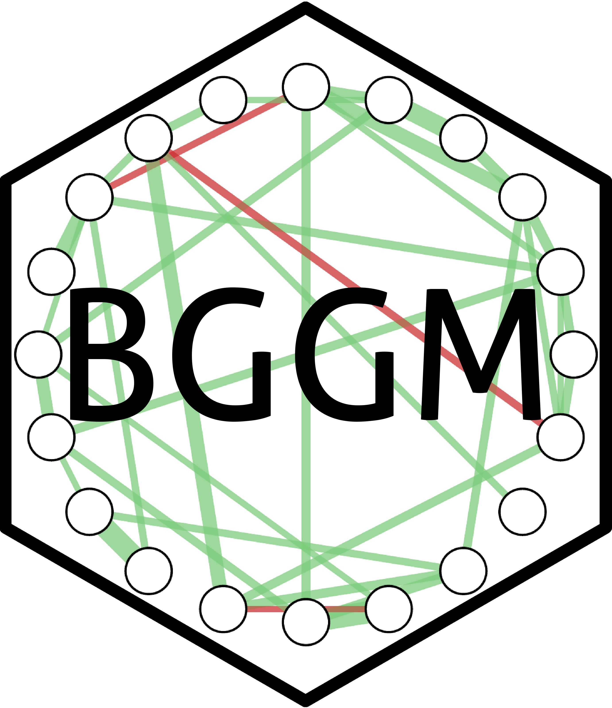

```{r setup, include=FALSE}
knitr::opts_chunk$set(echo = FALSE)
source(file.path("R", "functions.R"))
library(distilltools)
```

```{r metathis, message=FALSE, warning=FALSE, include=FALSE}
library(metathis)
meta() %>%
  meta_description(
    "Open-Source Software"
  ) %>%
  meta_name("github-repo" = "donaldRwilliams/donaldRwilliams.github.io") %>%
  meta_viewport() %>%
  meta_social(
    title = "DRW: Software",
    url = "https://donaldrwilliams.github.io/software.html",
    image = "https://donaldrwilliams.github.io/images/fire2.png",
    image_alt = "A photo of DRW",
    og_type = "website",
    og_author = c("Donald R. Williams"),
    twitter_card_type = "summary",
    twitter_creator = "@wdonald_1985"
  )
```

```{r, include=FALSE}
library(htmltools)
source("R/functions.R")
```

## Creator


### BGGM: Bayesian Gaussian Graphical Models
:::float-left




The {**BGGM**} R package is a collection of tools for making Bayesian 
inference in Gaussian graphical models. The methods are organized around two general approaches for Bayesian inference: (1) estimation and (2) hypothesis testing. The computationally intensive tasks (e.g., custom MCMC samplers) are written in `c++` via the `R` package **Rcpp** [@eddelbuettel2011rcpp] and the `c++` library **Armadillo** [@sanderson2016armadillo]. The Bayes factors are computed with the `R` package **BFpack** [@mulder2019bfpack].  There is full support for continuous, binary, ordinal,
and mixed data (via a Gaussian copula graphical model).
 

```{r, echo=FALSE}
icon_link(
    icon = "fas fa-external-link-alt",
    text = "CRAN",
    url  = "https://cran.r-project.org/web/packages/BGGM/index.html"
)

icon_link(
    icon = "fas fa-external-link-alt",
    text = "Website",
    url  = "https://donaldrwilliams.github.io/BGGM/"
)

```

 
:::

<!--   -->


## Contributor


<!-- ```{r} -->
<!-- create_proj_card( -->
<!--   img_src = "images/bggm_hex.jpg", -->
<!--   url = "https://github.com/donaldRwilliams/BGGM", -->
<!--   title = "{BGGM}", -->
<!--   text = "The {BGGM} R package is a collection of tools for Bayesian  -->
<!--   Gaussian graphical modeling.", -->
<!--   text2 = NULL -->
<!-- ) -->
<!-- ``` -->


<!-- ```{r, echo=FALSE} -->
<!-- icon_link( -->
<!--     icon = "ai ai-google-scholar", -->
<!--     text = "Downloads", -->
<!--     url  = "http://cranlogs.r-pkg.org/badges/grand-total/BGGM" -->
<!-- ) -->
<!-- ``` -->
<!-- ## Contributor -->