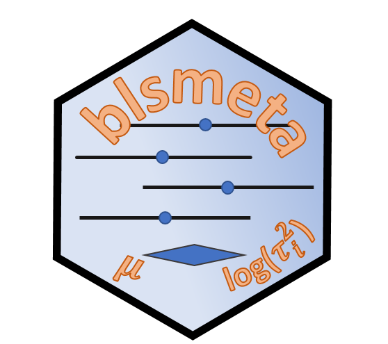

```{r setup, include=FALSE}
knitr::opts_chunk$set(echo = FALSE)
source(file.path("R", "functions.R"))
library(distilltools)
```

```{r metathis, message=FALSE, warning=FALSE, include=FALSE}
library(metathis)
meta() %>%
  meta_description(
    "Open-Source Software"
  ) %>%
  meta_name("github-repo" = "donaldRwilliams/donaldRwilliams.github.io") %>%
  meta_viewport() %>%
  meta_social(
    title = "DRW: Software",
    url = "https://donaldrwilliams.github.io/software.html",
    image = "https://donaldrwilliams.github.io/images/fire2.png",
    image_alt = "A photo of DRW",
    og_type = "website",
    og_author = c("Donald R. Williams"),
    twitter_card_type = "summary",
    twitter_creator = "@wdonald_1985"
  )
```

```{r, include=FALSE}
library(htmltools)
source("R/functions.R")
```

The {**BGGM**} an {**blsmeta**} `R` packages are under active development. 


## Creator


### **BGGM**: Bayesian Gaussian Graphical Models
:::float-left


The {**BGGM**} R package is a collection of tools for making Bayesian 
inference in Gaussian graphical models. The methods are organized around two general approaches for Bayesian inference: (1) estimation and (2) hypothesis testing. The computationally intensive tasks (e.g., custom MCMC samplers) are written in `c++`. The Bayes factors are computed with the `R` package **BFpack** 
(see below).  There is full support for continuous, binary, ordinal,
and mixed data (via a Gaussian copula graphical model).
 

```{r, echo=FALSE}
icon_link(
    icon = "fas fa-external-link-alt",
    text = "CRAN",
    url  = "https://cran.r-project.org/web/packages/BGGM/index.html"
)

icon_link(
    icon = "fab fa-github",
    text = "GitHub",
    url  = "https://github.com/donaldRwilliams/BGGM"
)

icon_link(
    icon = "fas fa-external-link-alt",
    text = "Website",
    url  = "https://donaldrwilliams.github.io/BGGM/"
)

```

 
:::

<br>

### **blsmeta**: Bayesian Location-Scale Meta-Analysis
:::float-left




The goal of {**blsmeta**} is to provide a user-friendly interface for
Bayesian meta-analysis, including fixed-effects, two-level, 
and three-level (for dependent effect sizes) 
random-effects models. Additionally, a key feature of {**blsmeta**} is "scale" modeling, which allows for predicting the variance components with moderators 
(e.g., perhaps between-study variance is not constant across studies). 
As a result, heterogeneity statistics and prediction intervals are then a function of those same moderators, thereby opening the door to **better
understanding heterogeneity in meta-analysis**. 


```{r, echo=FALSE}
icon_link(
    icon = "fab fa-github",
    text = "GitHub",
    url  = "https://github.com/donaldRwilliams/blsmeta"
)
```

:::


<br>

### **GGMnonreg**: Non-regularized Gaussian Graphical Models

:::float-left


The goal of {**GGMnonreg**} is to estimate non-regularized graphical models. Note that the title is a bit of a misnomer, in that Ising and mixed graphical models are also supported. Graphical modeling is quite common in fields with wide data, that is, when there are more variables than observations. Accordingly, many regularization-based approaches have been developed for those kinds of data. There are key drawbacks of regularization when the goal is inference, including, but not limited to, the fact that obtaining a valid measure of parameter uncertainty is very (very) difficult. {**GGMnonreg**}, on the other hand, was specifically built for low-dimensional data (e.g., those common to psychological networks).


```{r, echo=FALSE}
icon_link(
    icon = "fas fa-external-link-alt",
    text = "CRAN",
    url  = "https://cran.r-project.org/web/packages/GGMnonreg/index.html"
)

icon_link(
    icon = "fab fa-github",
    text = "GitHub",
    url  = "https://github.com/donaldRwilliams/GGMnonreg"
)
```

 

:::


<br>

### **GGMncv**: Gaussian Graphical Models with Non-Convex Penalties

:::float-left


The primary goal of {**GGMncv**} is to provide non-convex penalties for estimating Gaussian graphical models. These are known to overcome the various limitations of lasso (least absolute shrinkage “screening” operator), including inconsistent model selection, biased estimates, and a high false positive rate. 
An additional goal of {**GGMncv**} is to provide methods for making statistical inference in regularized Gaussian graphical models. This is accomplished with the de-sparsified graphical lasso estimator.

```{r, echo=FALSE}
icon_link(
    icon = "fas fa-external-link-alt",
    text = "CRAN",
    url  = "https://cran.r-project.org/web/packages/GGMncv/index.html"
)

icon_link(
    icon = "fab fa-github",
    text = "GitHub",
    url  = "https://github.com/donaldRwilliams/vICC"
)
```

 

:::


<br>

### **vICC**: Varying Intraclass Correlation Coefficients

:::float-left


The goal of {**vICC**} is to compute varying intraclass correlation coefficients (ICC) in a one-way random effects model. Often computing an ICC is the first step when fitting a mixed-effects model that results in merely one value that is assumed to apply to each group (e.g., person, school, etc.). The underlying assumption is a common within-group variance, whereas, in {**vICC**}, a random-effects model is fitted to the residual variance, thereby permitting group-level ICCs. When subjects are the grouping variable, this is akin to investigating individual differences in the ICC.

```{r, echo=FALSE}
icon_link(
    icon = "fas fa-external-link-alt",
    text = "CRAN",
    url  = "https://cran.r-project.org/web/packages/vICC/index.html"
)

icon_link(
    icon = "fab fa-github",
    text = "GitHub",
    url  = "https://github.com/donaldRwilliams/vICC"
)

```

 

:::


<br>

### **IRCcheck**: Irrepresentable Condition Check

:::float-left


The goal of {**IRCcheck**} is to check the irrepresentable condition in both L1-regularized regression and Gaussian graphical models. At it crux, the IRC states that the important and unimportant variables cannot be correlated, at least not all that much (total irrelevant covariance below 1). L1-regularization requires the IRC for consistent model selection, that is, with more data, the true model is recovered. The IRC cannot be checked in real data. The primary use for this package is to explore the IRC in a true model that may be used in a simulation study. 

```{r, echo=FALSE}
icon_link(
    icon = "fas fa-external-link-alt",
    text = "CRAN",
    url  = "https://cran.r-project.org/web/packages/IRCcheck/index.html"
)

icon_link(
    icon = "fab fa-github",
    text = "GitHub",
    url  = "https://github.com/donaldRwilliams/IRCcheck"
)
```

 

:::


<br>

### **BBcor**: Bayesian Bootstrapping Correlations
:::float-left


The goal of {**BBcor**} is to provide an efficient way to obtain samples from the posterior distribution of various correlation coefficients, including:
(1) Pearson, (2) Spearman, (3) Gaussian rank, (4) Kendall, (5) Blomqvist, and (6) polychoric.

```{r, echo=FALSE}
icon_link(
    icon = "fas fa-external-link-alt",
    text = "CRAN",
    url  = "https://cran.r-project.org/web/packages/BBcor/index.html"
)

icon_link(
    icon = "fab fa-github",
    text = "GitHub",
    url  = "https://github.com/donaldRwilliams/BBcor"
)
```

 

:::

<br>


## Contributor

### **BFpack**: Flexible Bayes Factor Testing of Scientific Expectations
:::float-left


The `R` package {**BFpack**} contains a set of functions for exploratory hypothesis testing (e.g., equal vs negative vs positive) and confirmatory hypothesis testing (with equality and/or order constraints) using Bayes factors and posterior probabilities under commonly used statistical models, including (but not limited to) Bayesian t testing, (M)AN(C)OVA, multivariate/univariate linear regression, correlation analysis, multilevel analysis, or generalized linear models (e.g., logistic regression). 

```{r, echo=FALSE}
icon_link(
    icon = "fas fa-external-link-alt",
    text = "CRAN",
    url  = "https://cran.r-project.org/web/packages/BFpack/index.html"
)

icon_link(
    icon = "fab fa-github",
    text = "GitHub",
    url  = "https://github.com/jomulder/BFpack"
)
```

 

:::


<br>

### **bayeslincom**: Linear Combinations of Bayesian Posterior Samples
:::float-left


The goal of {**bayeslincom**} is to provide point estimates, standard deviations, and credible intervals for linear combinations of posterior samples. Additionally, it allows for testing against using null values using a region of practical equivalence (ROPE) approach.

```{r, echo=FALSE}
icon_link(
    icon = "fas fa-external-link-alt",
    text = "CRAN",
    url  = "https://cran.r-project.org/web/packages/bayeslincom/index.html"
)

icon_link(
    icon = "fab fa-github",
    text = "GitHub",
    url  = "https://github.com/josue-rodriguez/bayeslincom"
)
```

 

:::


<br>

### **ICCier**: Open Datasets from Meta-analyses in Psychology
:::float-left
The goal of {**ICCier**} it to compute intraclass correlations (reliability) in general (classic ICC), per person, or per observation within persons. This is accomplished
with novel methodology that is based on the mixed-effects location scale model. This allows for fitting explanatory models to the true score (between-group) and error (within-group)
variance-- thereby opening the door to **explaining
reliability**. 

```{r, echo=FALSE}
icon_link(
    icon = "fab fa-github",
    text = "GitHub",
    url  = "https://github.com/stephensrmmartin/ICCier"
)
```

:::


<br>

### **psychmetadata**: Open Datasets from Meta-analyses in Psychology
:::float-left

This data package provides open datasets from meta-analyses from different areas in psychological science.

```{r, echo=FALSE}
icon_link(
    icon = "fas fa-external-link-alt",
    text = "CRAN",
    url  = "https://cran.r-project.org/web/packages/psychmetadata/index.html"
)

icon_link(
    icon = "fab fa-github",
    text = "GitHub",
    url  = "https://github.com/donaldRwilliams/psychmetadata"
)
```

 

:::
